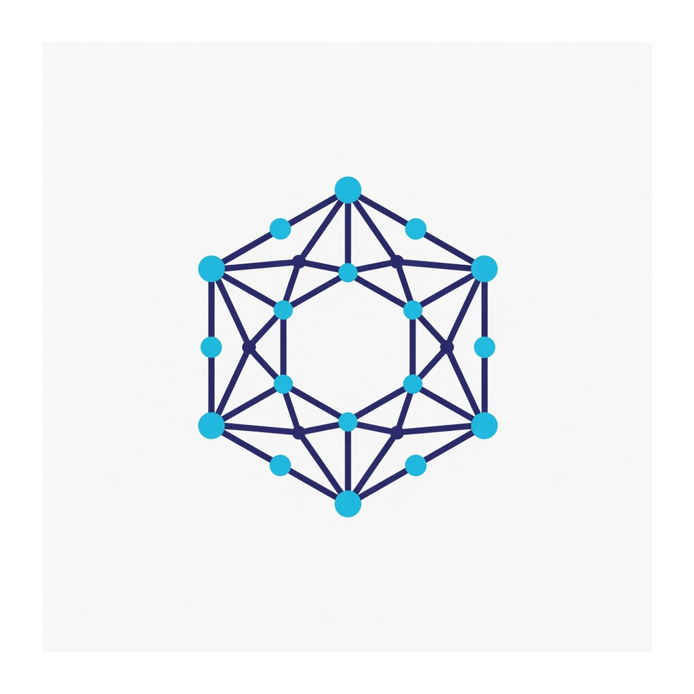
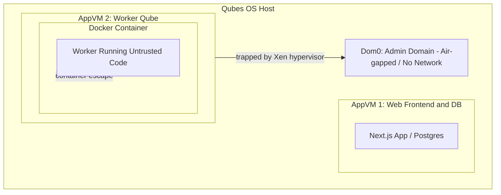

<p align="center">
  
</p>

<h1 align="center">BetterScan</h1>

<p align="center">
  <strong>Deep code security scanning</strong> — graph-aware CLI and self-hosted web platform.
</p>

<p align="center">
  <a href="https://github.com/betterscan-io/betterscan"></a>
  
  
</p>

**Lineage:** BetterScan continues the **Contender** project line shown at **Black Hat MEA 2025** in **Saudi Arabia** (Riyadh). Same mission—serious multi-engine code security—rebuilt for graph-aware analysis (Joern / Fraunhofer CPG), a modern Go runner, and a full self-hosted web platform. (Earlier names in this repo: Checkmate, Lattice.)

## License

BetterScan is licensed under the **[PolyForm Noncommercial License 1.0.0](LICENSE)**.

- Free for noncommercial use (personal, research, education, noncommercial orgs, and similar purposes defined in the license).
- **Commercial use requires a separate license** from the copyright holder.
- Third-party scanners BetterScan invokes keep their own licenses; see [THIRD_PARTY_NOTICES](THIRD_PARTY_NOTICES).

This monorepo contains:

- `betterscan-core/` – Go scanning engine (OpenGrep, Trivy, Bandit, staticcheck, Joern, Fraunhofer CPG)
- `betterscan-cli/` – CLI interface for the scanning engine
- `betterscan-java/` – Java wrappers and CPG integration
- `betterscan-web/` – Self-hosted platform (API, worker, Next.js + jQuery UIs, Redis scan queue, VCS integrations)
- `betterscan-graph/` – Graph-based scanning components
- `betterscan-sast/` – SAST integration layer
- `betterscan-agents/` – Tool integrations/agents
- `fixtures/vulnerable/` – Small multi-language samples for CLI smoke tests
- `deploy/cloud-run-jobs/betterscan/` – Cloud Run Jobs templates (run N tasks)
- `deploy/ecs-fargate/betterscan/` – ECS/Fargate templates (run N tasks)
- `broken-vulnerable-code-snippets/` – Vulnerable code dataset (cloned from https://github.com/snoopysecurity/Broken-Vulnerable-Code-Snippets)
- `Speed.md` – Benchmark results

## Install CLI (macOS / Linux / WSL)

```bash
curl -fsSL https://raw.githubusercontent.com/betterscan-io/betterscan/main/scripts/install.sh | sh
```

Also works:

```bash
curl -fsSL https://raw.githubusercontent.com/betterscan-io/betterscan/main/install.sh | sh
# custom prefix:
curl -fsSL https://raw.githubusercontent.com/betterscan-io/betterscan/main/scripts/install.sh | sh -s -- -b /usr/local/bin
# pin a release tag (when published):
curl -fsSL https://raw.githubusercontent.com/betterscan-io/betterscan/main/scripts/install.sh | sh -s -- -v v0.1.0
```

Use **`-fsSL`** (not `-sSL`) so HTTP errors fail instead of piping a GitHub HTML 404 into `sh`.  
If no GitHub release asset exists for your platform, the installer builds from source (requires **Go 1.22+** and **git**).

For CLI usage, see `betterscan-cli/README.md`. For the web stack, see `betterscan-web/README.md`.

**Graph engines:** BetterScan runs **Joern** for mature, excellent default vulnerability queries, and **Fraunhofer CPG** primarily for **new custom rules** and **project-specific enforcement** on a multi-language code property graph (library / extensible analyses—aligned with Fraunhofer's platform framing and tools such as Codyze). Details: [betterscan-core/README.md § Graph engines](betterscan-core/README.md#graph-engines-joern-vs-fraunhofer-cpg).

**Web VCS access:** Projects can link a **GitHub App** install (permissions + repo picker) or a **PAT/token** for GitLab, Bitbucket, GitHub, or generic HTTPS remotes. Scans are enqueued on Redis; the worker clones with short-lived credentials. Details: [betterscan-web/README.md § VCS](betterscan-web/README.md#vcs-github-app-vs-gitlab--bitbucket--other).

## Web Platform Frontends: Next.js vs jQuery

`betterscan-web/` provides a web UI for the platform with **two interchangeable
frontends** (same Go backend, same local email+password / JWT auth, same
Integrations + Projects + Scan Now flows). Both are
included on `main` and run side by side, so you can compare the look & feel and
choose one:

| Frontend | Stack | Port |
|---|---|---|
| Next.js | Next.js 16 + Tailwind + Base UI + Recharts | http://localhost:3000 |
| jQuery  | jQuery 3.7 + Bootstrap 5 + Chart.js (zero-build) | http://localhost:8081 |

```bash
cd betterscan-web && docker compose up      # then open :3000 and/or :8081
```

### Compare before installing

Text comparison of the two UIs (no screenshots in-repo):  
[`betterscan-web/docs/comparison/README.md`](betterscan-web/docs/comparison/README.md)

**Trade-off:** Next.js gives a nicer developer experience and a more modern look
but needs ongoing maintenance (npm audit churn, build, upgrades); the jQuery
version is plainer but zero-build and will run for years untouched. The two are
also available as single-frontend branches
([`frontend-nextjs`](https://github.com/betterscan-io/betterscan/tree/frontend-nextjs),
[`frontend-jquery`](https://github.com/betterscan-io/betterscan/tree/frontend-jquery))
if you want to deploy only one.

## Security & Isolation: Qubes OS for Workers

When scanning untrusted source code, container escape vulnerabilities in Docker (e.g. kernel exploits or runtime bugs in `runc`) pose a threat to the host system.

To mitigate this, BetterScan can run the worker component inside **Qubes OS** to isolate untrusted code execution using Xen-based hypervisor-level compartmentalization:



Even if malicious code manages to exploit a vulnerability and escape the Docker container, the attacker remains trapped inside the isolated VM boundary, protecting your host, database, and other components from being compromised.

For detailed setup instructions on making Docker storage persistent in Qubes OS using `bind-dirs` or shifting the `data-root`, see [QUBES_OS_DOCKER.md](QUBES_OS_DOCKER.md).

