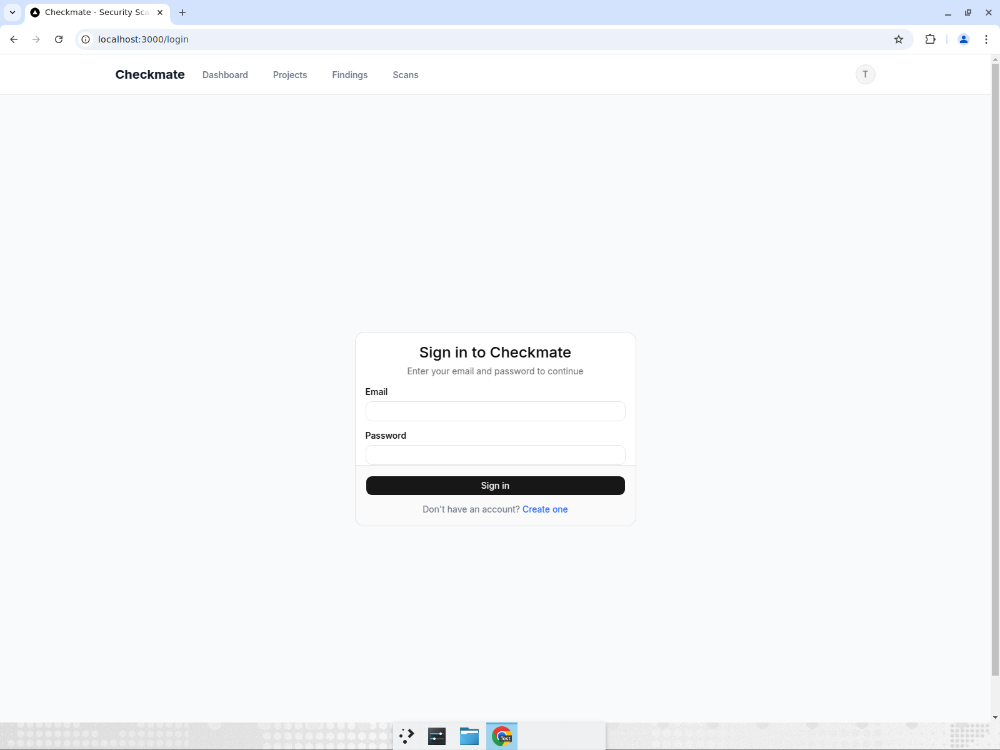
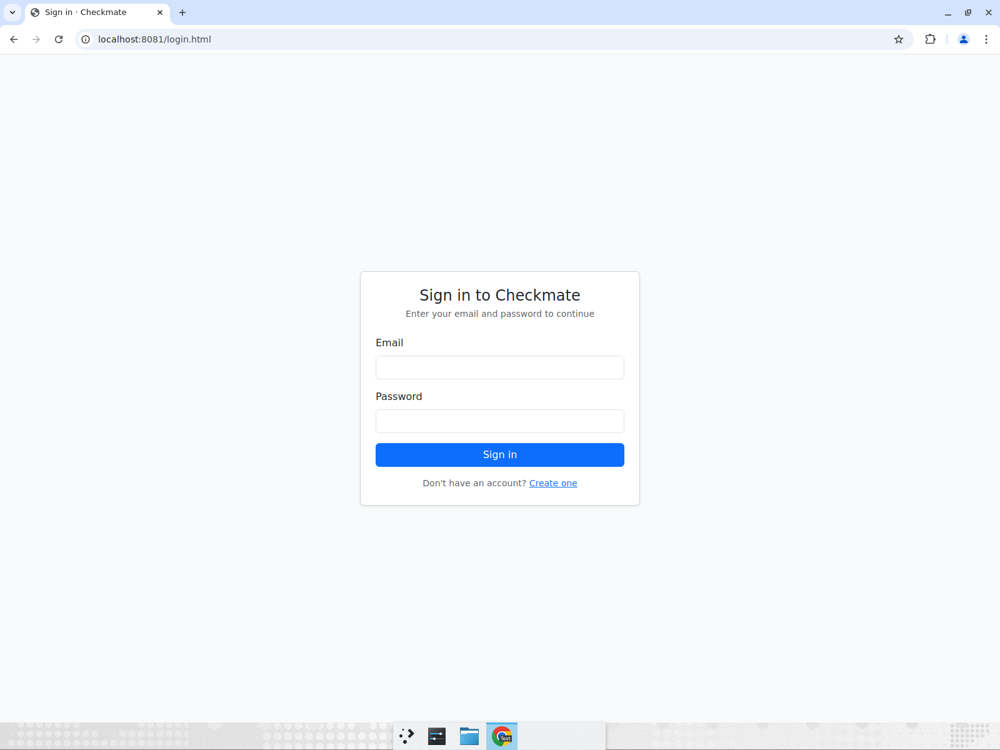
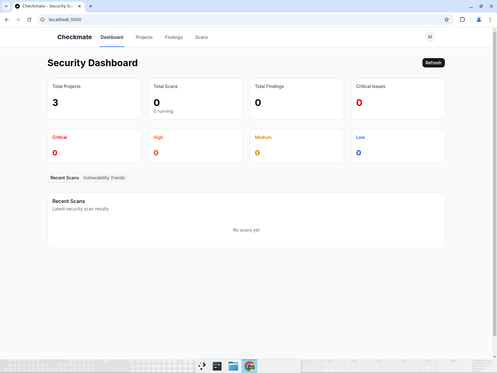
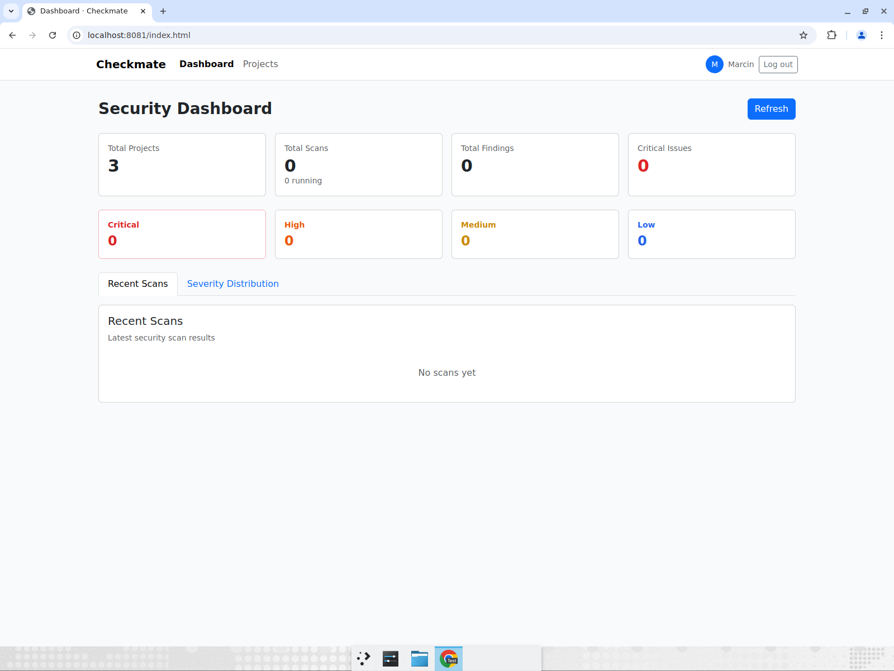
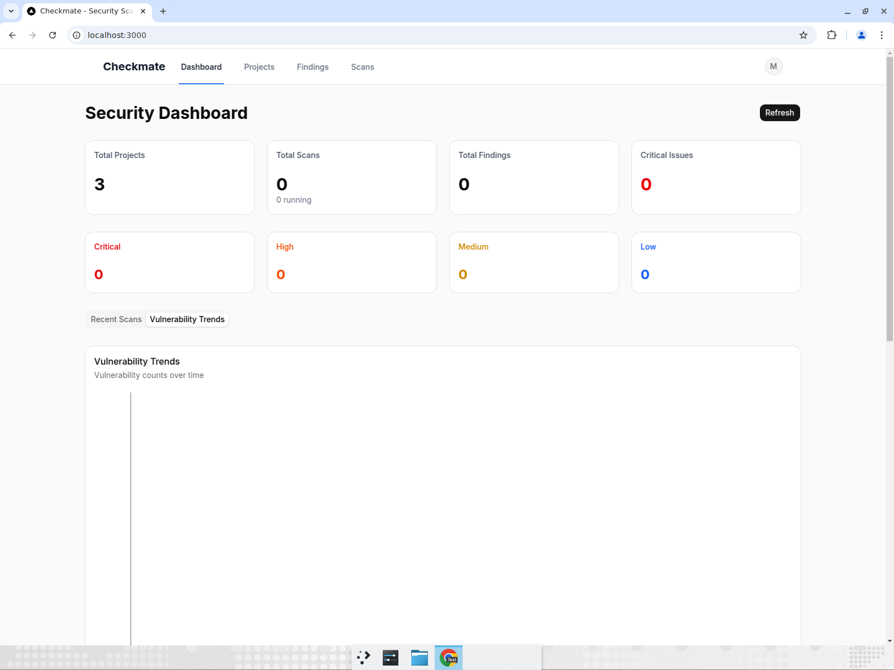
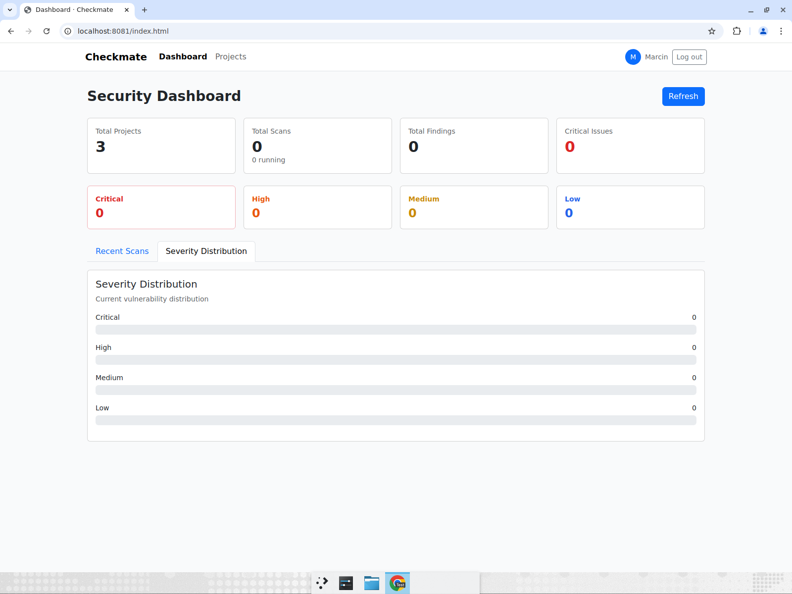
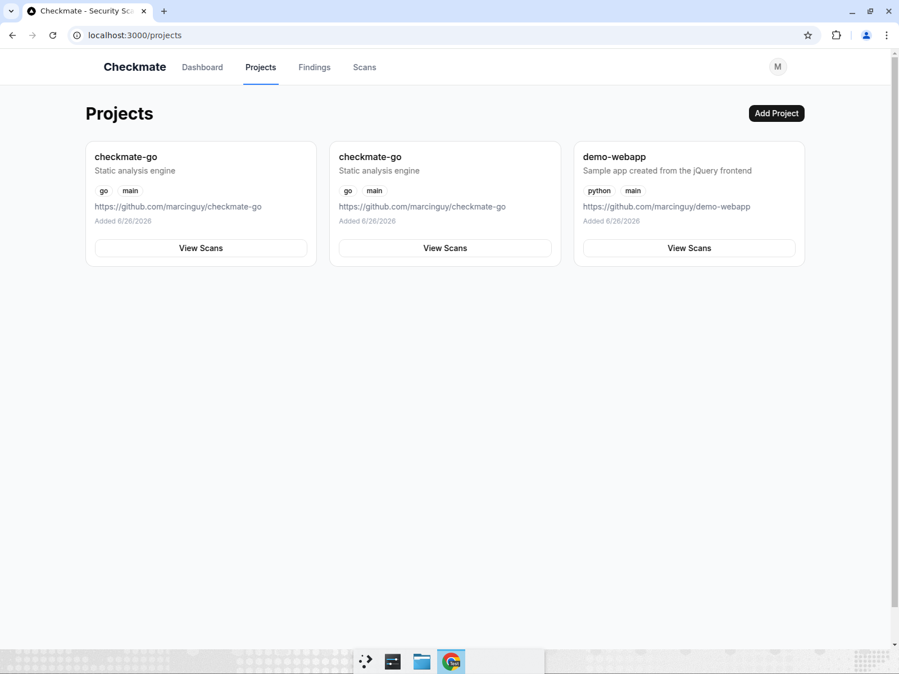
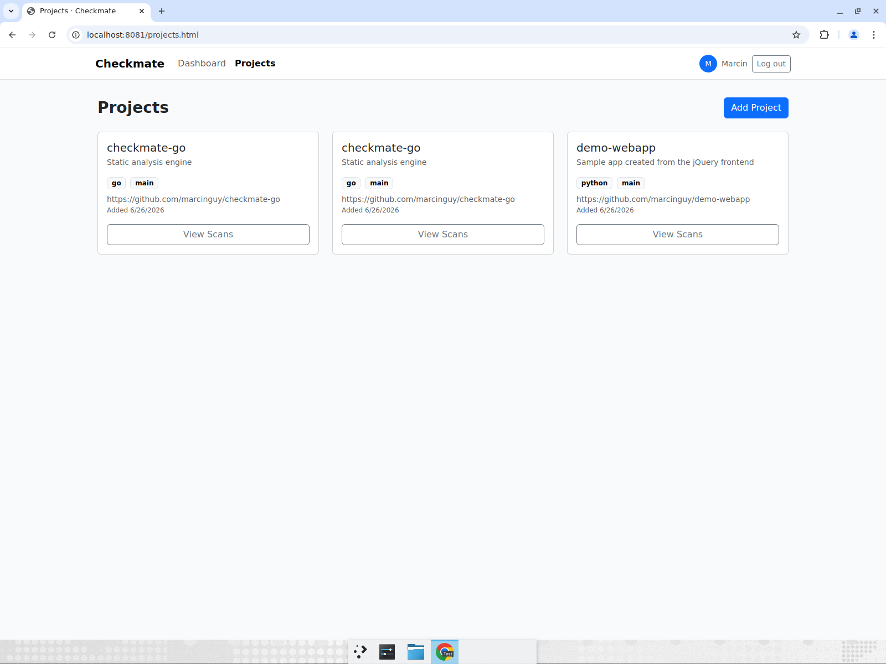
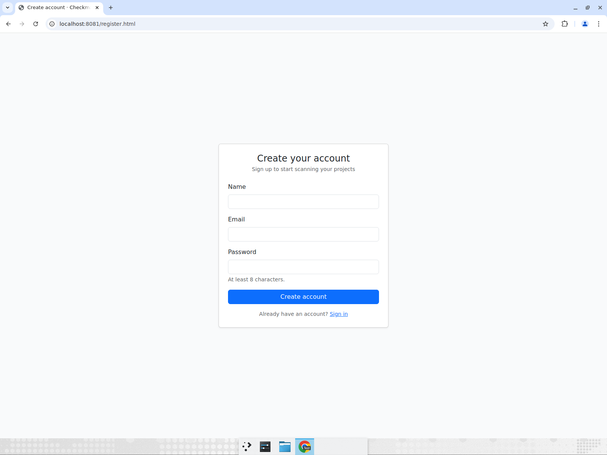

# Frontend Comparison: Next.js vs jQuery

Checkmate ships **two** interchangeable frontends that talk to the same Go
backend (same local email+password / JWT auth). Both pass the same end-to-end
flow. Pick whichever look & feel you prefer — screenshots of every screen are
below so you can compare before installing.

| | Next.js | jQuery |
|---|---|---|
| Stack | Next.js 16 + Tailwind + Base UI + Recharts | jQuery 3.7 + Bootstrap 5 + Chart.js |
| Port | http://localhost:3000 | http://localhost:8081 |
| Build | `npm` install + build step, periodic upgrades | zero-build, vendored, runs untouched for years |
| Look | flat, airy, lots of white space | denser, classic Bootstrap cards |

Run both side by side: `cd checkmate-web && docker compose up` →
Next.js on :3000, jQuery on :8081.

## Side-by-side screenshots

### Login
| Next.js | jQuery |
|---|---|
|  |  |

### Dashboard (stats + severity breakdown)
| Next.js | jQuery |
|---|---|
|  |  |

### Vulnerability trends / severity distribution
| Next.js | jQuery |
|---|---|
|  |  |

### Projects
| Next.js | jQuery |
|---|---|
|  |  |

### Register
| Next.js | jQuery |
|---|---|
|  |  |

Charts/severity panels are empty in these shots because there are no scans yet —
the same is true for both frontends.

The Next.js build also has a user dropdown menu for logout
([screenshot](screenshots/nextjs/05-user-menu.png)); the jQuery build puts the
Log out button directly in the nav bar.
