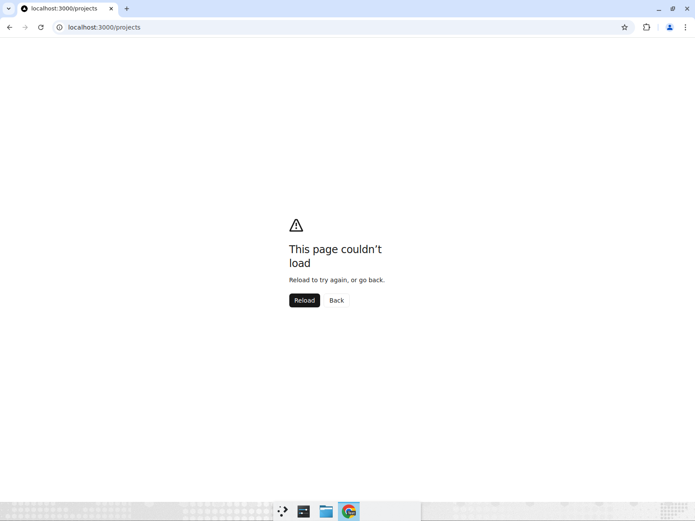
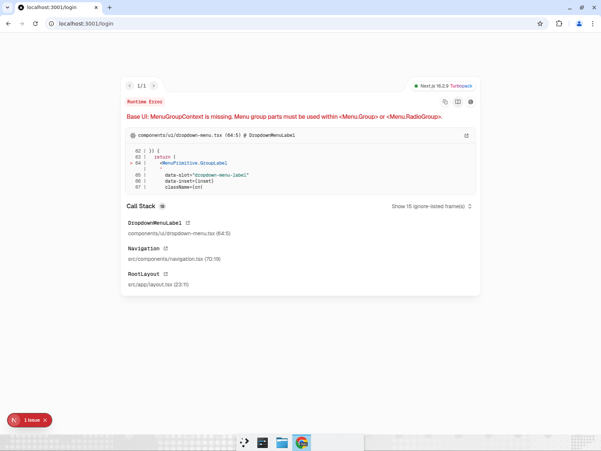
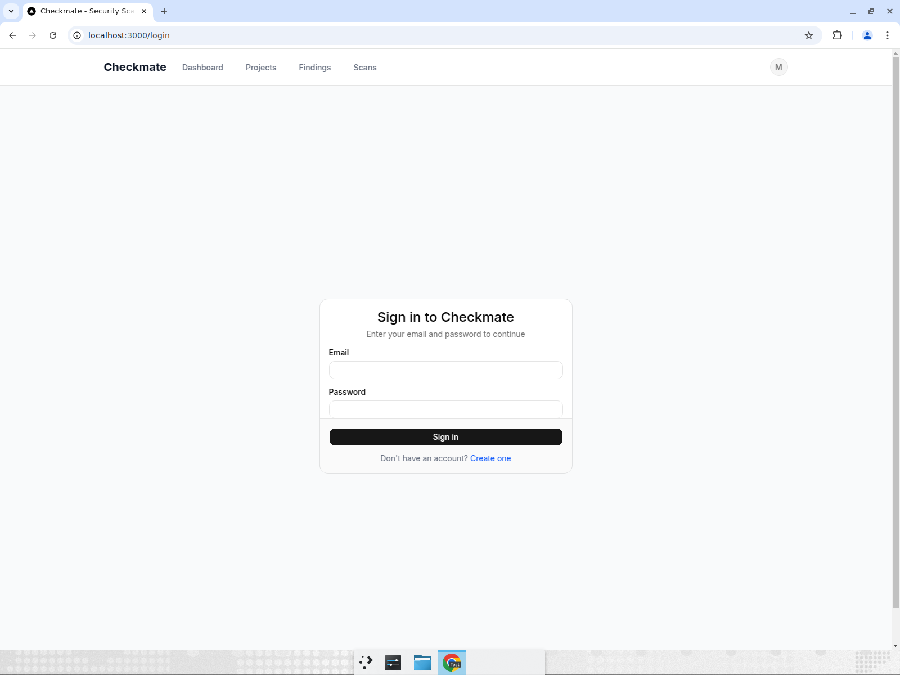
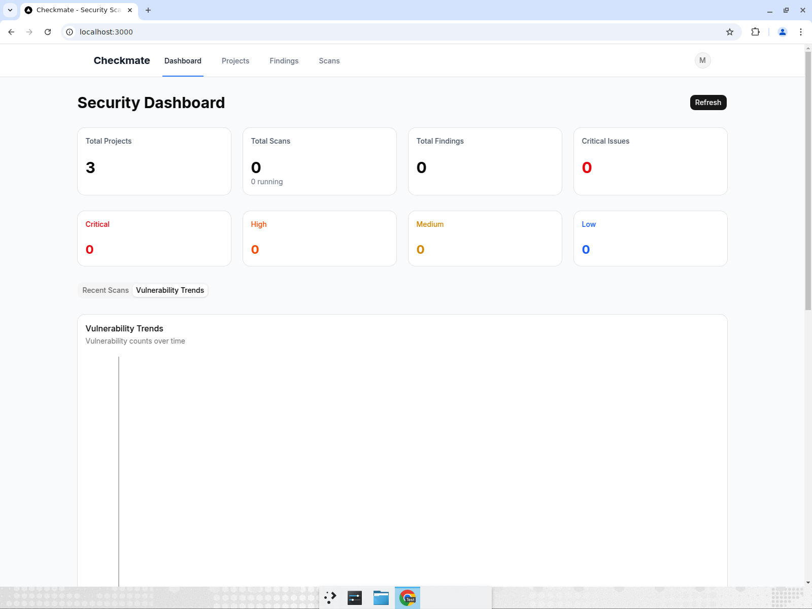
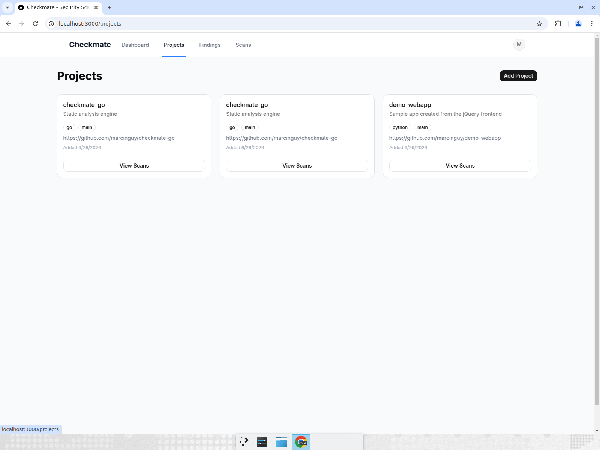
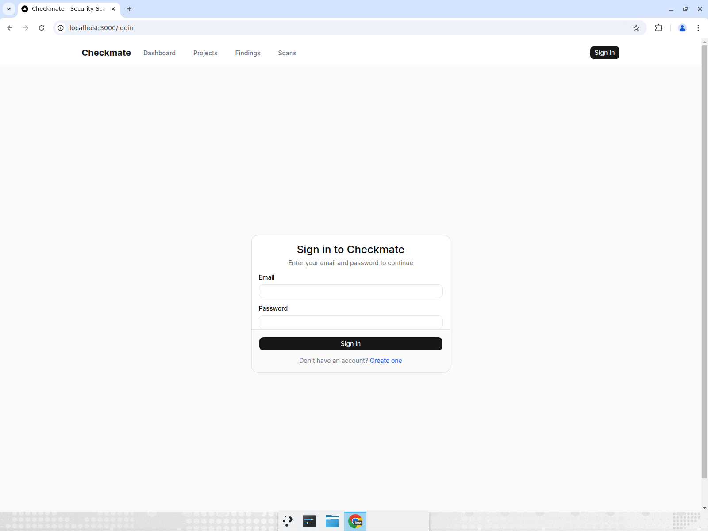
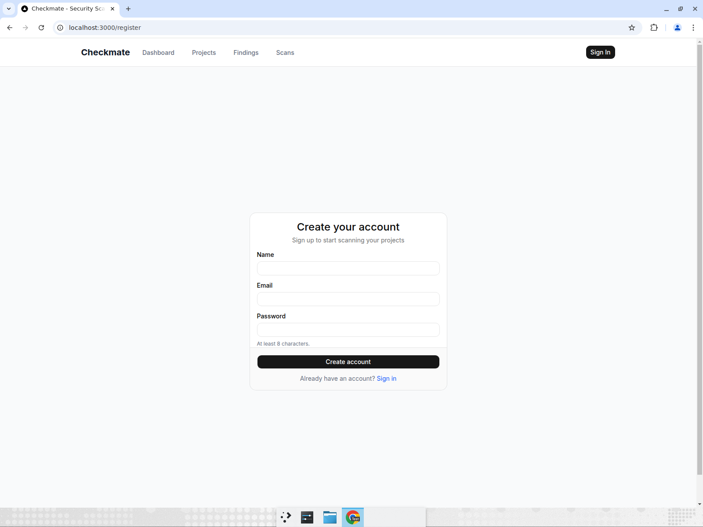
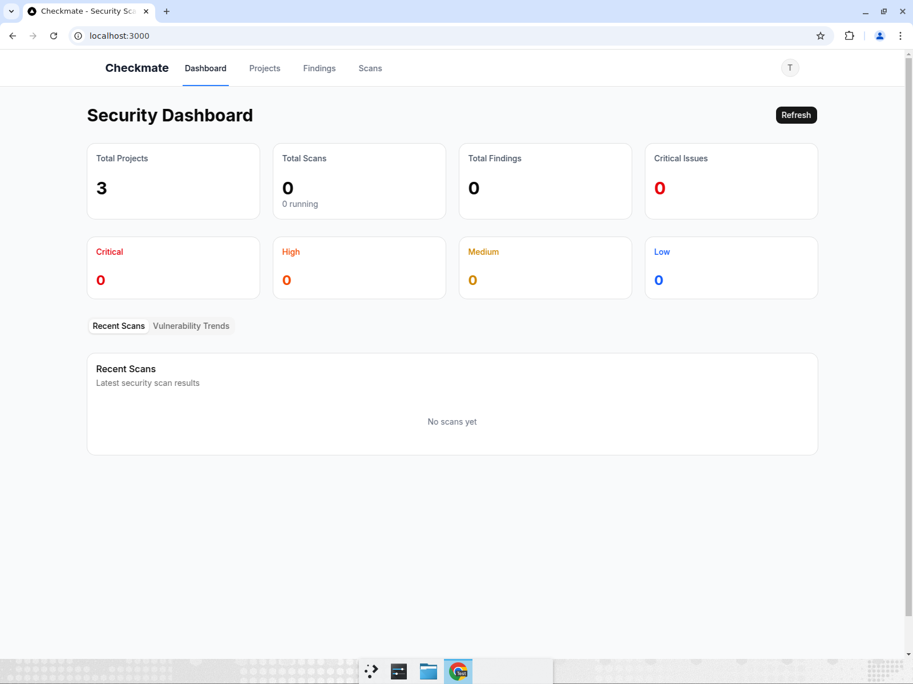

# Next.js Frontend — End-to-End Test Report

**App:** Checkmate (Next.js 16 + next-auth + Base UI + Recharts)
**URL:** http://localhost:3000 (Docker, production build)
**Auth:** local email+password (JWT), user `marcin@example.com`
**Goal:** run the same e2e flow recorded for the jQuery frontend so look/feel can be compared.

## Result: PASS (after fixing a crash)

| # | Test | Result |
|---|------|--------|
| 1 | Log in with email + password | PASS |
| 2 | Dashboard stats + severity breakdown render | PASS |
| 3 | Vulnerability Trends charts render | PASS |
| 4 | Projects page lists projects | PASS |
| 5 | Log out via avatar dropdown | PASS (was crashing — fixed) |
| 6 | Register a new account (auto-login) | PASS |

## Bug found & fixed: avatar dropdown crashed the whole page

Clicking the user avatar (to reach **Log out**) rendered the Next.js error
boundary — "This page couldn't load" — which blocked logout entirely.

Running the dev server surfaced the real cause (two Base UI violations in
`frontend/src/components/navigation.tsx`):

1. `DropdownMenuTrigger` wrapped a `Button`, producing nested `<button>` elements.
2. `DropdownMenuLabel` (Base UI `Menu.GroupLabel`) was used **outside** a
   `Menu.Group`. Base UI requires group labels to live inside a `Menu.Group`
   or `Menu.RadioGroup`, otherwise it throws `MenuGroupContext is missing`.

**Fix:** apply button styling to the trigger via `buttonVariants()` (no nested
button) and wrap the label in `DropdownMenuGroup`. Fixed on the `frontend-nextjs` branch.

## Evidence — full flow

Login page:

Dashboard (stats + severity breakdown):

Vulnerability Trends (line + Severity Distribution charts, empty because there
are no findings yet — same as jQuery):

Projects (3 cards):

After logout → back to login:

Register page:

Registered + auto-logged in (avatar "T"):

